> Note: This repo was uploaded to GitHub in order to showcase the feature-rich Bash CLI utility (with a Python app indicator system service) that I spent houdreds of hours of personal time working on as a side project over 3 years while working at GEOTAB. This tool saw widespread adoption and praise by developers at the company, with it becoming standard software for houndreds of developers and being said by management to have "significantly increased the productivity of the entire Development department". It was based on a CLI project that I developed while studying in university, which was essentially a framework for building Bash CLI utilitys.

> This branch is the unrealeased version of what would have been `geo-cli 3.0`, the next major release of the utility. The massive changes in the codebase and feature-set is comparable to the differences between Python 2 and Python 3 (huge changes/improvments, around 20,000 changes from the previous version). Unfortunantly, I didn't have time to finish it before leaving the company in 2023.

# `geo-cli`

A tool that makes MyGeotab development easier. Specifically, this tool aims to simplify cross-release development by managing various versions of `geotabdemo` Postgres database containers. This allows developers to easily switch between release branches without having to worry about database compatibility.
The tool has also evolved over the years to include a taskbar UI menu as well as many time-saving features that simplify other pain points of daily development by automating them; providing an easy-to-use interface that hides the complexity under the hood and makes developers more productive.

> `geo-cli` is currently under active development and is updated often. Feel free to make an [MR](https://git.geotab.com/dawsonmyers/geo-cli/-/merge_requests/new) if you would like to contribute improvements or features.
>
> **Note:** `geo-cli` *is only supported on Ubuntu*. However, it can be made to work in WSL on Windows if you set up docker for it.

> 💬 **Join the geo-cli Chat Space** [here](https://chat.google.com/room/AAAAo9gDWgg?cls=7) (currently with more than 80 members) to report bugs, share feature ideas, and stay informed about new features. You can also contact me on Chat or through email (dawsonmyers@geotab.com).
>
> ⭐ **Like geo-cli?** Add a star to the [repo](https://git.geotab.com/dawsonmyers/geo-cli).

## Table of Contents

- [`geo-cli`](#geo-cli)
   - [Table of Contents](#table-of-contents)
   - [Tab Completion](#tab-completion)
   - [Example](#example)
   - [Getting Started with `geo-cli`](#getting-started-with-geo-cli)
      - [Install](#install)
      - [Create a Database](#create-a-database)
         - [Import pgAdmin Server for MyGeotab](#import-pgadmin-server-for-mygeotab)

   - [Databases](#databases)
      - [Copy](#copy)
      - [List](#list)
      - [Remove](#remove)
         - [Remove All](#remove-all)

      - [Create an Empty Database](#create-an-empty-database)
      - [Query the Database](#query-the-database)

   - [Run Pipeline Analyzers](#run-pipeline-analyzers)
      - [Options](#options)

   - [Connecting to Servers Using IAP Tunnels](#connecting-to-servers-using-iap-tunnels)
      - [Connect to Remote Database using pgAdmin](#connect-to-remote-database-using-pgadmin)

   - [Encode/Decode MyGeotab Long and Guid Ids](#encodedecode-mygeotab-long-and-guid-ids)
      - [Examples](#examples)

   - [Run Tests](#run-tests)
   - [Set up a GitLab Personal Access Token (PAT)](#set-up-a-gitlab-personal-access-token-pat)
   - [Quarantine Tests](#quarantine-tests)
   - [Convert MyDecoder JSON Device Data to MyGeotab Log File](#convert-mydecoder-json-device-data-to-mygeotab-log-file)
   - [Run Gateway](#run-gateway)
      - [Run Standalone Gateway](#run-standalone-gateway)
      - [Run MyGeotab with Gateway](#run-mygeotab-with-gateway)

   - [Add git Hook](#add-git-hook)
   - [Create Your Own `geo-cli` Command (`geo <command>`)](#create-your-own-geo-cli-command-geo-command)
      - [Example](#example-1)
         - [Automate Initializing MyGeotab for Local Development](#automate-initializing-mygeotab-for-local-development)

      - [Create a Command for Your Team](#create-a-command-for-your-team)
      - [Develop Commands In Any Language](#develop-commands-in-any-language)
      - [Tips \& Tricks](#tips--tricks)
         - [Passing Arguments](#passing-arguments)
         - [Shifting \& Slicing Positional Arguments](#shifting--slicing-positional-arguments)

- [`geo-ui` (NEW)](#geo-ui-new)
   - [Databases](#databases-1)
      - [Running DB](#running-db)
      - [Databases](#databases-2)
      - [Create Database](#create-database)

   - [Auto-Switch](#auto-switch)
      - [Auto-Switch DB](#auto-switch-db)
      - [Auto-Install npm](#auto-install-npm)
      - [Auto-Switch server.config](#auto-switch-serverconfig)
      - [Auto-Clean GeotabDemo Data](#auto-clean-geotabdemo-data)

   - [Dev Utilities](#dev-utilities)
      - [Run Analyzers](#run-analyzers)
      - [npm install](#npm-install)
      - [Convert MyGeotab Long/Guid Ids](#convert-mygeotab-longguid-ids)
      - [Access Requests](#access-requests)

   - [Help](#help)
   - [Updates](#updates)

- [Help](#help-1)
- [Troubleshooting](#troubleshooting)
   - [Update issues](#update-issues)
   - [Problems Creating Databases](#problems-creating-databases)

<!-- Make images > 892 px wide -->

## Tab Completion

If running in a bash sell, `geo-cli` has extensive support for tab completion (double pressing the Tab key). It will show you what commands/subcommands are available, as well as possible command arguments for certain commands such as `geo db start/rm`.

Completion for `geo` shows all commands available:

```sh
$ geo <double press tab>
analyze     edit        id          mydecoder   stop        
ar          env         image       myg         test        
cd          get         indicator   quarantine  uninstall   
db          gw          init        rm          update      
dev         help        loc         set         version
```

Completion for `geo db start` will show all of your databases (that you created with `geo-cli`) that can be started:

```sh
$ geo db start 
6_0    7_0    8.0    9.0    91     
```

## Example

Lets say that you're developing a new feature on a `2004` branch of MyGeotab, but have to switch to a `2002` branch for a high priority bug fix that requires the use of `geotabdemo` (or any compatible database, for that matter). Switching to a compatible database is as simple as checking out the branch, **building the project** (only required when creating a new db container), and then running the following in a terminal:

```bash
geo db start 2002
```

> `2002` in the above command is just a name that you pick for the container and volume that `geo` creates for you; it can be any alphanumeric name (including underscores and hyphens) you like. If a db container with that name already exists, it will just start that one instead of creating a new one.

The output of this command is shown below:


> Under the hood, `geo` is creating a Postgres container and a data volume for it. The tool then starts the container, mounted with the data volume, and then initializes `geotabdemo` on it using `dotnet CheckmateServer.dll CreateDatabase postgres ...`. This is why you have to build the project for a certain release branch before creating a new db container.

Now you may run `geotabdemo` or any tests that require a 2002 database version.

When you're done with the bug fix and want to resume working on your 2004 feature, switch back to your 2004 branch and run the following in a terminal:

```bash
geo db start 2004
```

The output of this command is shown below:


## Getting Started with `geo-cli`

### Install

Navigate to your directory of choice in a terminal and clone this repo

```bash
git clone git@git.geotab.com:dawsonmyers/geo-cli.git
```

Next, navigate into the repo directory

```bash
cd geo-cli
```

And finally, if you are in a `bash` shell, run the following command to execute the install script.

```bash
source install.sh
```

If you use a shell other that `bash`, the install **must** be run like this:

```bash
bash install.sh
```

The installer will add support for `zsh` and `fish` to their corresponding config files. If you use a different shell, add the following alias to its config file:

```bash
alias geo="bash <full path geo-cli repo dir>/src/geo-cli.sh"
```

> Docker is required for `geo` to work. You will be prompted to install it during the install process if it is missing. **You must completely log out and then back in again after a Docker install for the new permissions to take effect.**

You will be asked to enter the location of Development repo during the install. The tool needs to know where this is so that it knows the location of:

- The CheckmateServer dll used for initializing `geotabdemo`
- The Dockerfile used to create the base Postgres image used to build the db containers

The tool will also build the base Postgres image during the install process, so it may take several minutes to complete (even longer if you also have to install Docker).

A simple install (where I already have Docker installed and have created the base db image) is shown below:


Now you can open a new terminal or run `. ~/.bashrc` to re-source .bashrc in your current one to begin using `geo`.

<!-- ### Start Using `geo-cli` -->

Now that `geo-cli` is installed, you can begin using it for creating and running various database versions for your development needs.

### Create a Database

The first thing that you want to do after installing the tool is to create a database. The MyGeotab Postgres database will be created using `CheckmateServer.dll` from the current branch that you have checked out. `geo` will automatically build MyGeotab.Core so that the correct dll will be used for initializing the database.

Next, we will create, initialize, and start your first database. You will have to give it an alphanumeric name to identify it (the MyGeotab release version is usually the best name to use, e.g., `2004`). So, assuming that you're working on a `2004` branch of MyGeotab, a database could be created by entering the following in a terminal:

```bash
geo db start 2004
```

> You will be prompted to stop Postgres if you have it running locally or in a container. This is so that port 5432 can be made available for a `geo-cli` database.

The output is shown below:


> You can choose to use a different Postgres version via the `-v <pg_version:int>` argument (e.g. `geo db start -v 14 <db_container_name>`)

#### Import pgAdmin Server for MyGeotab

After creating a `geo-cli` database container, you will be shown instructions on how to import a server configuration into gpAdmin. The following gif demonstrates this process.

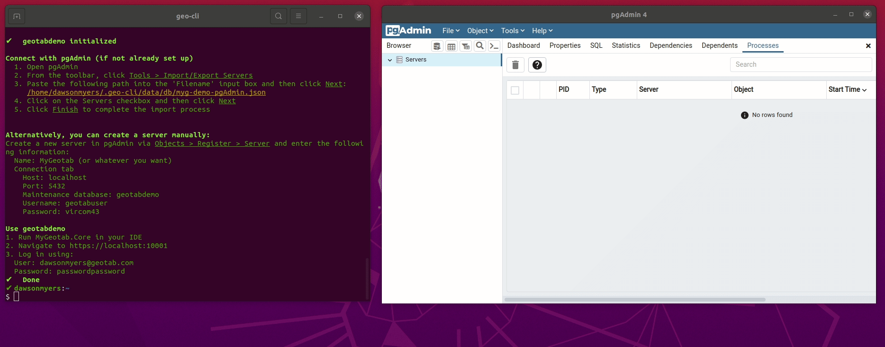

> Note: You only have to import the server configuration once. It will work with any `GeotabDemo` database that's running.

## Databases

### Copy

You can make a copy of a `geo-cli` database using:

```bash
geo db cp <source> <destination>
```

Example:

```bash
$ geo db cp 8.0 8.0-copy

Creating destination database volume '8.0-copy'

Copying data from source database volume '8.0' to '8.0-copy'
✔️   Done

Creating destination database container '8.0-copy'
✔️   Done

```

### List

You can list your `geo-cli` databases using:

```bash
geo db ls
```


### Remove

The following command will remove the `2001` database from `geo-cli`:

```bash
geo db rm 2001
```


You can confirm that the `2001` database has been removed by listing your `geo-cli` databases:

```text
geo db ls
```


#### Remove All

You can delete all databases using `geo db rm --all`/`geo db rm -a`. You will be prompted before continuing. Additionally, you can add a filter to the command. For instance, if you wanted to remove all databases that contain the string `test`, you would use `geo db rm -a test`.

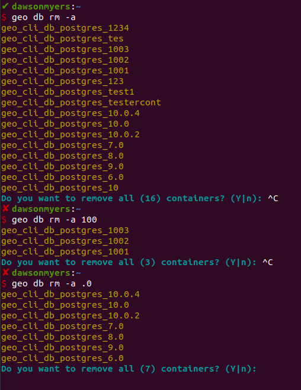

### Create an Empty Database

`geo-cli` can also be used to create empty databases for any use case you may encounter:


This creates a MyGeotab postgres db with the sql admin as **geotabuser** and the password as **vircom43**.

If you would like a completely empty Postgres 12 db (or any PG version using the `-v <version:int>` option) without any initialization, add the **-e** option to the command, e.g., `geo db create -e <name>`.

The default user for the database is `postgres` and the password is `password`. This username/password can be used to connect to the db (once started) using pgAdmin or psql (using `geo db psql`) . This database is just a plain, off-the-shelf Postgres database container (built from the official Postgres docker image), you can use it for anything: to experiment with or even for use with a side project, if you like. `geo-cli` will make sure that only one database container is running at a time, ensuring that the required port, 5432, is always available.

> The `geo db create` command does not start the container after creating it. Use `geo db start <name>` to start it.

### Query the Database

pgAdmin can be used to interact with the database, or `geo db psql` can be used to start an interactive psql session with a running database container. If you just want to run a single query, you can use the `-q` option to specify a sql query:

```bash
geo db psql -q 'SELECT * FROM deviceshare'
```

> Note: The query must be enclosed in single quotes

## Run Pipeline Analyzers

Want to run analyzers locally instead of pushing to GitLab and waiting for the pipeline to fail?. `geo analyze` saves you a ton of time by easily letting you do this:

```bash
geo analyze
```

This will output the selection menu and prompt you for which analyzers you want to run:

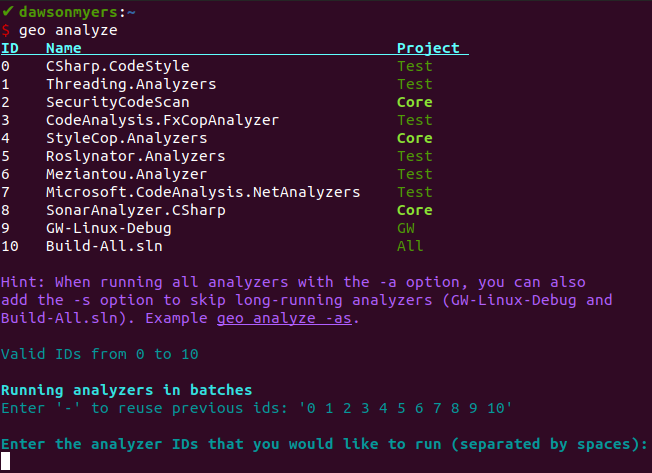

So if you wanted to run `CSharp.CodeStyle` and `StyleCop.Analyzers` you would type `0 4` and press enter:

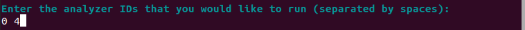

The output is then displayed as the analyzers are run:

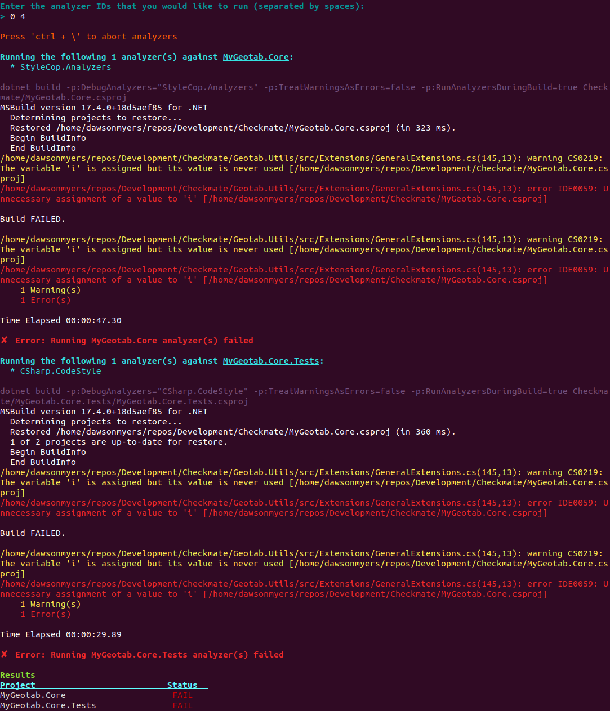

### Options

The following options can be used with `geo analyze`:

- **\-** This option will reuse the last test ids supplied
- **\-a** This option will run all tests
- **\-s** Skips long-running analyzers (GW-Linux-Debug and Build-All.sln), allowing you to quickly check your code before pushing it to GitLab

> I aliased `geo analyze -as` to `gaa` (via adding `alias gaa='geo analyze -as'` to `~/.bashrc`) to allow me to quickly run all analyzers (excluding the long-running ones) before pushing changes by opening up any terminal and running `gaa`. You can add this alias to your .bashrc file if you like with this command: `echo "alias gaa='geo analyze -as'" >> ~/.bashrc`. You can also quickly paste `alias gaa='geo analyze -as'` into your .bashrc file by using `geo-ui`'s *Edit > .bashrc* menu item. This will open up the .bashrc file in a text editor.

## Connecting to Servers Using IAP Tunnels

`geo-cli` can be used to simplify connecting to servers over IAP tunnels. First, make an access request for a server using MyAdmin. Then copy *gcloud compute start-iap-tunnel* command by pressing the copy button:

> `geo ar create` can be used to open up the My Access Request page on the MyAdmin website in Chrome. This page can be used to create a new access request.

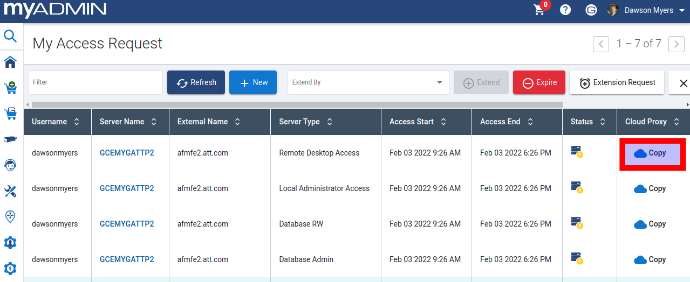

After that, paste the gcloud command in a terminal as an argument to `geo ar tunnel` as shown below:

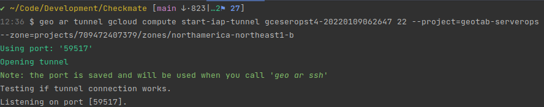

> `geo-cli` will remember the gcloud command so that you can re-open the tunnel by running just `geo ar tunnel` without the gcloud command. It also remembers the port that the tunnel is running on so that you don't have to include it when running `geo ar ssh`

Now you can open another terminal and run the `geo ar ssh` command to ssh into the server:

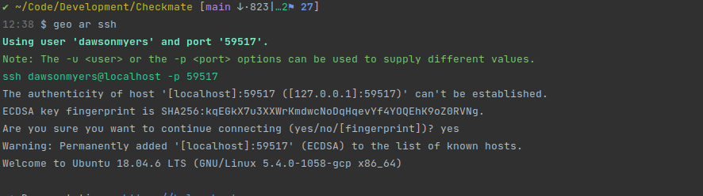

> By default, the username stored in th $USER environment variable is used when connecting to the server with `geo ar ssh`. You can set the default username by supplying it with the `-u <username>` option. You can also use a different port using the `-p <port>` option.

### Connect to Remote Database using pgAdmin

You can add the -L option to either `geo ar tunnel` or `geo ar ssh` to bind local port 5433 to 5432 on remote host (through IAP tunnel). You can connect to the remote Postgres database using this port (5433) in pgAdmin. Note: you can also open up an ssh session to this server by opening another terminal and running `geo ar ssh`.

Now you can connect to the Postgres database in pgAdmin by creating a server via Objects > Register > Server. Then enter in the following information:

- Host: localhost
- Port: 5433
- username: <your username (what comes before @geotab.com in you email)>
- Password: <the password you got from MyAdmin when you created the Access Request>

## Encode/Decode MyGeotab Long and Guid Ids

Use the `geo id <id>` command to both encode and decode long and guid ids to simplify working with the MyGeotab api. The result is copied to your clipboard (if you have xclip installed). Guid encoded ids must be prefixed with 'a' and long encoded ids must be prefixed with 'b'"

### Examples

Long Encode

```bash
$ geo id 1234
Encoded long id: 
b4d2
copied to clipboard
```

Long Decode

```bash
$ geo id b4d2
Decoded long id: 
1234
copied to clipboard
```

Guid Encode

```bash
$ geo id 00e74ee1-97e7-4f28-9f5e-2ad222451f6d
Encoded guid id: 
aAOdO4ZfnTyifXirSIkUfbQ
copied to clipboard
```

Guid Decode

```bash
$ geo id aAOdO4ZfnTyifXirSIkUfbQ
Decoded guid id: 
00e74ee1-97e7-4f28-9f5e-2ad222451f6d
copied to clipboard
```

You can also convert multiple ids in a single line, regardless of whether decoding or encoding is required.

```bash
$ geo id 1234 b4d2 aAOdO4ZfnTyifXirSIkUfbQ
b4d2
1234
00e74ee1-97e7-4f28-9f5e-2ad222451f6d
copied to clipboard
```

## Run Tests

The `geo test <filter>` command can be used to run tests on your local build. The filter behaves the same as in [dotnet test --filter](https://docs.microsoft.com/en-us/dotnet/core/testing/selective-unit-tests?pivots=xunit). By default, tests matching the given `filter` will be run on your local machine. When run with the `-d` or `--docker` option, the tests will be run in a docker container which matches the one used in CI/CD pipelines instead. This option requires [docker to be logged into gitlab](https://git.geotab.com/dev/Development/container_registry/), and is only supported from 9.0 onwards.

## Set up a GitLab Personal Access Token (PAT)

Go to https://git.geotab.com/-/profile/personal_access_tokens and create a token with api access and copy the PAT to your clipboard. Make sure to also make a note of the PAT somewhere safe since you won't be able to view it again.

Now we are going set up the required environment variables. Run the following command:

```sh
  geo init pat
```

Paste in your PAT and enter your GitLab username when prompted.

> Your GitLab username is what comes before *@geotab.com*, e.g., my email is dawsonmyers@geotab.com, so I would enter *dawsonmyers* as my username.

Next, we'll use your PAT to log into the GitLab docker container registry.

```sh
  docker login git.geotab.com:4567
```

You will then be prompted for your GitLab username and a password. Paste (Ctrl + Shift + V) the access token in your clipboard when asked for the password.

## Quarantine Tests

Use `geo quarantine <FullyQualifiedTestName>` to quickly add quarantine attributes to a broken test.

Before running `geo quarantine ...`:

```cs
    [Fact]
    public void Test()
    {
```

After:

```cs
    [Fact]
    [Trait("TestCategory", "Quarantine")]
    [Trait("QuarantinedTestTicketLink", "")]
    public void Test()
    {
```

```html
geo quarantine [options] <FullyQualifiedTestName>
      Adds quarantine attributes to a broken test and, optionally, commits the test file.
        Options:
            -b
                Only print out the git blame for the test.
            -c
                Commit the file after adding the annotations to it.
            -m <msg>
                Add a custom commit message. If absent, the default commit
                message will be "Quarantined test $testclass.$testname".
        Example:
            geo quarantine -c CheckmateServer.Tests.Web.DriveApp.Login.ForgotPasswordTest.Test
            geo quarantine -c -m 'Quarentine test' CheckmateServer.Tests.Web.DriveApp.Login.ForgotPasswordTest.Test
```

## Convert MyDecoder JSON Device Data to MyGeotab Log File

`geo mydecoder <MyDecoderExportedJsonFile>` converts device data from MyDecoder (exported as JSON) into a MyGeotab text log file. Here are a couple ways that these log files can be processed by MyGeotab to reproduce bugs:

- Copy the converted log file into the `~/GEOTAB/Checkmate/geotabdemo_data` so that MyGeotab will ingest the log file as if it had come from the Gateway.
- Set up a test that will process it as a file data source through the DDIS.

To convert device data from MyDecoder into a MyGeotab text log file, export the data from MyDecoder to JSON by clicking on the Export Data button as shown in the image below:

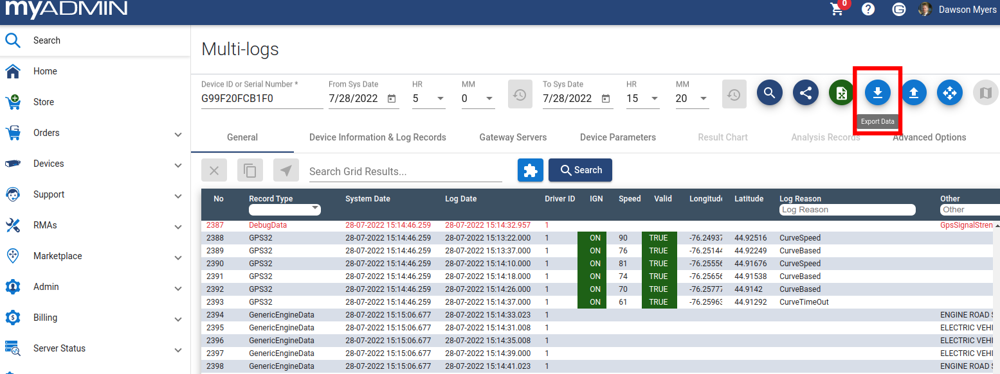

Then, open up a terminal in the JSON file's directory and run `geo mydecoder <filename.json>`. After the command has run, the output file will be in the same directory, with the same name, but with a .txt file extension. This file can be processed by MyGeotab just like any other log file.

You can also convert a JSON file by right clicking on it and selecting the `Scripts > [geo-cli] MyDecoder JSON To Txt` option.

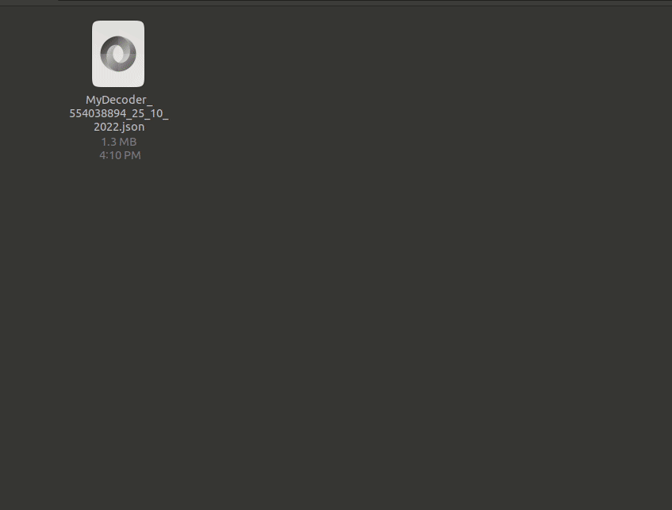

> Note: This feature is only available for MYG 9.0 and above, so you must have a compatible version of MYG checked out for it to work.

## Run Gateway

### Run Standalone Gateway

Run the `geo gw` command with desired options to `build`, `start`, `stop`, `restart` or `clean` a standalone Gateway. These options can also be accessed in the UI menu under `Gateway`.

> Note: The `geo-ui` icon will contain a blue dot when the Gateway is running and/or a green dot when MyGeotab is running.

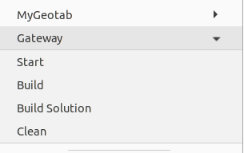

### Run MyGeotab with Gateway

Run the `geo myg gw` command to run MyG along with Gateway. This will create an empty database with the provided \<databaseName>, insert a device into the vehicle table, update the server.config and storeforward.config with required changes, and copy certs (may require sudo login).

Similarly, you can also accomplish this using the `MyGeotab > Run with Gateway` in the `geo-ui` menu.

> You can restart a MyGeotab and Gateway configuration at a later date by clicking on the `MyGeotab > Run with Gateway` `geo-ui` menu item and then typing in the same company name and database container name when prompted.

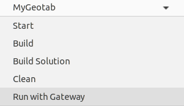

Once you have MyG and GW running, send a multilog message to the device using [deviceConnectAndListen_2.py](https://git.geotab.com/foxteam/utilities/-/blob/develop/hardware/deviceConnectAndListen_2.py):

```sh
python3 deviceConnectAndListen_2.py activate
```

To verify the connection, open https://127.0.0.1:10001/\<databaseName> via the `MyGeotab > Open In Browser` `geo-ui` menu item. Then, navigate to `Engine & Maintenance > Engine & Device > Measurements` in the web UI and apply a filter for the current date. You should now see one command listed as shown in the image below:
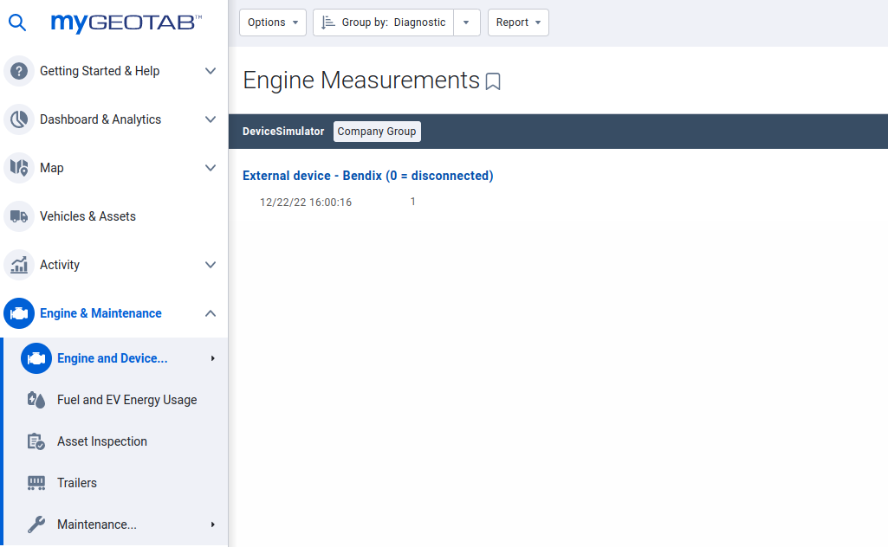

> Note: If no command is listed, you might also want to check if using port 443 is enforced and update to allow using a port other than 443.

## Add git Hook

Run the `geo init git-hook` command to add the prepare-commit-msg git hook that prepends the MYG issue number to each commit you make. It parses the issue number from the branch name.

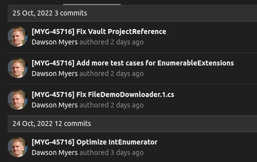

## Create Your Own `geo-cli` Command (`geo <command>`)

```sh
geo cmd <create|rm|ls|edit>
```

Have you identified a manual development process or repetitive task that you think could be automated through scripting? Or maybe you've already created a script of your own that saves you time and would like to share it with others? Well adding it to `geo-cli` is a great way to make it conveniently available to the entire Development department.

This is where the `geo cmd` command comes in, it greatly simplifies adding features to `geo-cli` by scaffolding out a new command for you. Just run `geo cmd create <command>` to initialize and register the command with `geo-cli`. By the time the `create` command completes, VS Code can be automatically opened to the new command's template file (to add its logic) and you'll be able to access it in any terminal by running `geo <command>`. A branch for the new command can also be created for you during the setup process.

<!-- > Important `geo cmd` directory paths:
>  - user commands directory: ~/.geo-cli/data/commands

Your command file will be created in its own directory and have a path like this `command-directory/command-file` and will follow this naming format: `geo-<command>/geo-<command>.cmd.sh`. By default, new command directories will be created in the **repo commands** directory (at */src/cli/commands* in your local `geo-cli` repo). However, during the `geo cmd create <command>` setup process, you will be asked if you would like to have your command added to the **user commands** directory (located at *~/.geo-cli/data/commands*) instead. This will allow you to experiment locally with your command without having to switch to a different branch or commit any code. The command will still be available through `geo <command>`, but you can stay on the main `geo-cli` branch; allowing you to both receive `geo-cli` update notifications (via `geo-ui`) and update like normal. You won't be notified about updates unless you are on the main `geo-cli` branch.

> You can always move your command to the **repo commands** directory, add it to a branch, and submit a merge request for it later if you would like to share it with others.


### Example

#### Automate Initializing MyGeotab for Local Development

Lets say, that you and your team regularly use some shared python files to initialize geotabdemo for local development. A typical development workflow for the team looks like this:

- Run a Python script, `get_device_data.py`, to download json device logs from MyDecoder between dates, anonymizes it (changes dates, removes vin/hardwareIds, etc.), and finally writes the logs back to a json file, `device_serial-logs.json`.
- Run `geo mydecoder` to convert the json file into a log file, `device_serial-logs.txt`, that can be ingested by MYG.
- Start a local instance of MYG.
- Run another Python script, init_myg_for_logs.py device-logs.txt`, which makes some api calls to a local MYG instance to do some set up (create devices, users, rules, etc., that match the logs).
- Open Chrome to the Maps page in the local MYG web app.
- Get MYG to process the file by adding the *.manualprocess* extension and copying it to the `geotabdemo_data` directory.
- Open the api runner and log into geotabdemo.
- Make api calls to get more information about the logs that were processed.

Much of this could be automated by creating a new `geo-cli` command, lets call it `manualprocess`, by running `geo cmd create manualprocess`. After that, add your scripts to the command directory, which should look like this:

```sh
geo-manualprocess/
    geo-manualprocess.cmd.sh
    get_device_data.py
    init_myg_for_logs.py
```

Now you would just have to populate the command function with a little bash to wire everything together (this could all technically be done in an additional python script to avoid writing any bash, as you'll see shortly):

> All top-level `geo-cli` commands (i.e., `geo <command>`) have a corresponding public bash function named like so: `geo_<command>` (e.g., `geo db` has a function called `geo_db` that can be called from any terminal).

```bash
# Assuming that your geo-cli repo is located at ~/repos/geo-cli, 
# The command file for this function would be located at: 
#   ~/repos/geo-cli/src/cli/commands/geo-manualprocess/geo-manualprocess.cmd.sh
geo_manualprocess() {
    # Parse and validate arguments/options.
    local device_serial=$1
    local from_date=$2
    local to_date=$3
    local file_name="${device_serial}-logs"

    # It's encouraged to log some kind of status information to show the progress
    # of the command and create a better user experience.
    # This is the only status update shown in this code example in order to
    # simplify it, but a real command should have status updates before every
    # significant stage of execution.
    # Info about geo-cli log functions:
    #   The log::status function prints out bright blue text and is the standard 
    #   format for geo-cli status/progress logs. There are many log helper functions
    #   defined in /src/utils/logs.sh. They all have names of the form 'log::<name>' 
    #   to signify that they are defined in a file called log.sh.
    log::status "Running get_device_data.py"

    # Get the device data from MyDecoder.
    python3 get_device_data.py \
      "$device_serial_number" \
      "$from_date" \
      "$to_date" \
      --output-file-name "$file_name.json"

    # Convert json to a MYG text log file. The output file will have the same name,
    # but with a '.txt' extension instead of '.json'.
    geo mydecoder "$file_name.json"

    # Start a local MYG instance.
    geo myg start

    # Initialize MYG (with rules, users, devices, etc.) to prepare it to process the logs.
    python3 init_myg_for_logs.py "$file_name.txt"

    # Open the maps page to observe the effects of the file being processed.
    google-chrome 'https://localhost:10001/geotabdemo#map'

    # This is a helper function, defined in /src/cli/cli-handlers.sh, for getting confirmation
    # from the user before continuing the script.
    prompt_continue "Press Enter when you're ready to have the log file processed by MYG: "

    # Copy the log file to be automatically processed by MYG.
    cp "$file_name.txt" ~/GEOTAB/Checkmate/geotabdemo_data/$file_name.manualprocess

    # Automatically open up and log in to the api runner.
    geo dev api-runner

    # This function will print "✔  Done" out to the console in bright green text. It is
    # commonly used in geo-cli commands to communicate the success of something.
    log::success "Done"
}
```

> The `geo_manualprocess` function is created in a command file that is based off of a template. It is full of help documentation and examples to guide you through coding your command.

### Create a Command for Your Team

The `manualprocess` command from the previous section would be very helpful to the members of the team using it, but it seems like it's quite tailored just to the needs of the that team. Having many of these types of niche commands would could make it more difficult for other `geo-cli` to tell which ones are relevant/potentially useful to them. And so, if you have several niche tasks that you would like to add `geo-cli` commands for, but you don't think that other dev teams would benefit, then it's best to group them under a top-level command named after your team. For example, if team By Design uses several scripts to accomplish tasks that are specific to the team, but have no real use to other developers. Then you can create a `geo-cli` command called `fox` to group together all of your team's unique tasks. You can then create subcommands for any relevant task you like. Example:

```md
geo fox <subcommand> [options] [arguments]
  • Commands that automate various tasks encountered by team By Design.
  • subcommands
    - init-ddis
    - run-rule-processor-tests
    - etc.
  • Examples
    - geo run-rule-processor-tests --timeout 10
    - geo init-ddis --enable-logs
```

### Develop Commands In Any Language

Don't like writing bash scripts? No problem, just include a script (or scripts) written in the language of your choice and call it from your `geo-cli` command file. This allows you to add features to `geo-cli` while writing the bare minimum amount of bash.

For example, we could just as well have written all of the `geo_manualprocess` function from the previous section entirely in a separate Python file, `geo_manualprocess.py`. Your command directory could look like after adding the new Python file and organizing the other ones (by adding them into their own `scripts` subdirectory):

```bash
geo-manualprocess/
    geo-manualprocess.cmd.sh
    geo_manualprocess.py
    scripts/
        get_device_data.py
        init_myg_for_logs.py
```

```bash
geo_manualprocess() {
    local device_serial=$1
    local from_date=$2
    local to_date=$3

    python3 geo_manualprocess.py \
      "$device_serial_number" \
      "$from_date" \
      "$to_date"
    
    # Display an error message if there was an error running the python script.
    # The $? variable holds the return code of the previous function. Any non-zero
    # return code mean that an error occurred.
    if (( $? != 0 )); then
      log::Error "geo_manualprocess.py did not complete successfully"
      return 1
    fi

    log::success "Done"
}
```

The code above could actually be reduced even more to look like this:

```bash
geo-manualprocess() {
    if python3 geo_manualprocess.py "$@"; then
      log::success "Done"
    else
      log::Error "geo_manualprocess.py did not complete successfully"
      return 1
    fi
}
```

### Tips & Tricks

#### Passing Arguments

In the last example for the `geo_manualprocess` code in the previous section, `"$@"` was used to pass all positional arguments (`$1`, `$2`, etc.) in the current function to another one (`python3 geo_manualprocess.py "$@"`) while maintaining proper quoting (similar to a spread operator from other languages). `$@` without quotes will result in all arguments being split up using the space character (' ') as a delimiter.

**Example**: Lets say that we have a function called `print_args` that prints its arguments out first using `"$@"`, then using `$@`:

```bash
print_args() {
  # $@ with quotes
  echo '"$@"'
  for arg in "$@"; do
    echo $arg
  done
  echo '$@'
  # $@ Without quotes
  for arg in $@; do
    echo $arg
  done
}
  
```

This is what the output looks like when running it with arguments that have spaces in them:

```bash
$ print_args "First argument" "Second argument"
"$@"
First argument
Second argument
$@
First 
argument
Second 
argument
```

As you can see, `"$@"` maintains the proper quoting of arguments, which is why it's very useful for passing on arguments to other functions.

> Conversely, `"$*"` will join all positional arguments into a single string.

#### Shifting & Slicing Positional Arguments

If you want to use the first couple of positional arguments before passing the rest to another function, you can use the `shift` function to shift all positional args one position to the left, so the value of `$1` would be replaced by `$2`, `$2` replaced by `$3`, and so on. If you want to shift more than once, lets say 3 times, just use `shift 3`.

Additionally, if you just wanted to pass a *slice* of positional arguments to another function, say all arguments after `$1`, you can use `"${@:2}"` (all args starting at the second one) like this: `print_args "${@:2}"`

# `geo-ui` (NEW)

`geo-ui` is a tray menu UI (app indicator) that further simplifies MyGeotab development. It allows users to quickly access most of `geo-cli`'s features, as well as adding some additional ones, with just a couple mouse clicks.


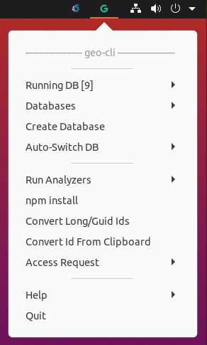

## Databases

The first section of the menu contains controls related to working with MyGeotab database containers.

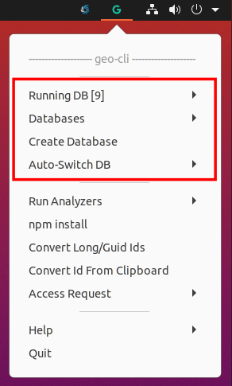

### Running DB

This menu item shows the name of the database that is currently running inside of square brackets (e.g. `Running DB [9]` for a db named "9"). If no database is running, the item will be disabled and its label will be "No DB running". It also has a submenu that provides the following functionality:

* `Stop`: Stops the database container
* `SSH`:  Opens a terminal and starts an SSH session into the db container
* `PSQL`:  Opens a terminal, starts an SSH session into the db container, and then starts a psql session for the geotabdemo database

> The G tray icon will be green if a database is running or red if there isn't one running.

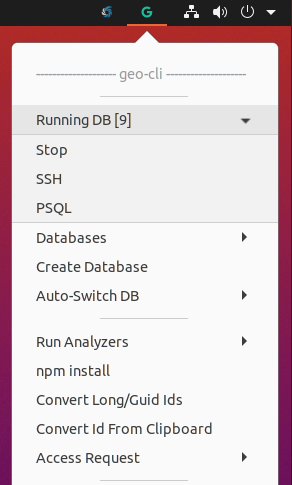 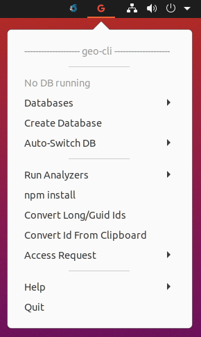

> There seems to be a bug in the framework used to build the menu items that will sometimes remove underscores from labels. So if you have a db named 9_0, it might be rendered as 'Running DB [90]'.

### Databases

This item allows you start or remove any of your database containers.

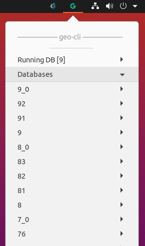 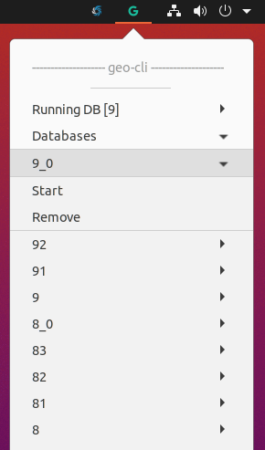

### Create Database

This item opens a terminal and will guide you through creating a new MyGeotab database.

> Note: Make sure you have built MyGeotab.Core on the current branch that you have checked out. The db container will be compatible with the MyGeotab release version of that branch.

> You usually want to name the database container after the MyGeotab release version that it is compatible with (e.g. '9' for version 9.0).

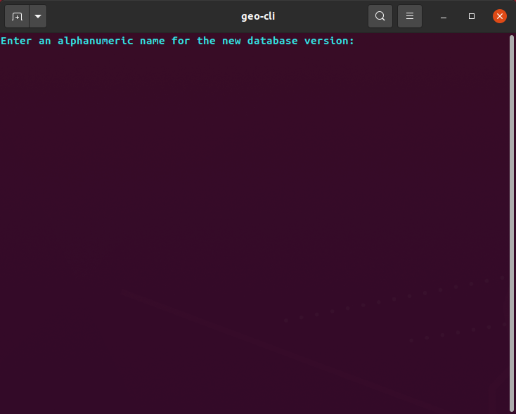

## Auto-Switch

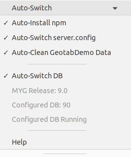

The Auto-Switch feature performs certain tasks when the checked out MyGeotab release version changes (i.e., from 8.0 to 9.0).
This submenu contains the following items:

1. `Auto-Install npm`: Enables/disables auto-installing npm in both the `CheckmateServer/src/wwwroot` and `CheckmateServer/src/wwwroot/drive` directories
2. `Auto-Switch server.config`: Enables/disables auto-switching server.config files
3. `Auto-Clean GeotabDemo Data`: Enables/disables auto-clean for geotabdemo data
4. `Auto-Switch DB`: Enables/disables auto-switching database containers
5. `MYG Release: ...`: Displays the MyGeotab release version of the currently checked out branch
6. `Configured DB: ...`: Displays the name of the database container that is linked to the current MyGeotab release version
7. `Set DB for MYG Release/Configured DB Running`: Links the current MyGeotab release version to the running database container

### Auto-Switch DB

You can link a MyGeotab release version to a database container by doing the following:

1. Checkout a MyGeotab release branch that you want to link a database container to. The `MYG Release` label shows the MyGeotab release version of the current branch
2. Start a compatible database container (using the `Databases` submenu)
3. Click the `Set DB for MYG Release` button under the `Auto-Switch` submenu

The `Configured DB` label will now show the name of the database container and the `Set DB for MYG Release` button will be disabled and labeled `Configured DB Running`.

Now the configured database container will automatically start whenever you checkout a branch based on its linked MyGeotab release version.

### Auto-Install npm

When enabled, `npm install` will automatically be run in both the `CheckmateServer/src/wwwroot` and `CheckmateServer/src/wwwroot/drive` directories.

### Auto-Switch server.config

When enabled, the server.config file will automatically be switched based on the MyGeotab release version of the Development branch that is currently checked out.

This example shows how it works once enabled:

1. Auto-Switch server.config is enabled for the first time
2. The MyGeotab release version of your current branch is `8.0`
3. You edit the server.config file with specific settings for `8.0`
4. You checkout a `9.0` branch
5. The server.config file at `~/GEOTAB/Checkmate/server.config` is copied and renamed to `~/.geo-cli/data/server-config/server.config_8.0`
6. Since this is the first time you have switched release versions with this feature enabled, there isn't a `9.0` server.config version available in `~/.geo-cli/data/server-config/`, so the file at `~/GEOTAB/Checkmate/server.config` remains unchanged
7. You edit the server.config file with specific settings for `9.0`
8. You checkout the `8.0` branch again
9. The server.config file at `~/GEOTAB/Checkmate/server.config` is copied and renamed to `~/.geo-cli/data/server-config/server.config_9.0`
10. The matching file for the release version is copied and renamed from `~/.geo-cli/data/server-config/server.config_8.0` to  `~/GEOTAB/Checkmate/server.config`, replacing the current server.config file with the `8.0` version

You can now continue switching to different release branches and setting up specific settings in the server.config for each one. Your changes will always be saved/restored when switching to/from a certain MyGeotab release branch.

### Auto-Clean GeotabDemo Data

When enabled, the geotabdemo_data directory in `~GEOTAB/Checkmate/` will be removed when the MyGeotab release version changes. The data generated in this directory may not be compatible between releases and can cause errors when starting up geotabdemo. This file will always be recreated when geotabdemo starts up if it is missing.

## Dev Utilities

These items provide access to utilities that aim to simplify MyGeotab development.

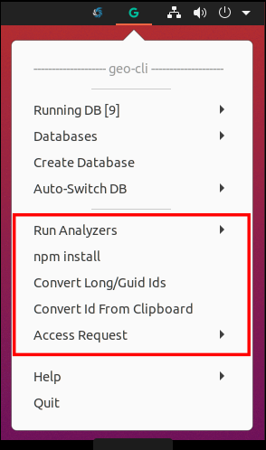

### Run Analyzers

This submenu provides the following options:

1. `All`: Runs all analyzers
2. `Choose`: Lets you choose analyzers from a list that you would like to run
3. `Previous`: Runs the same analyzers as you ran last time

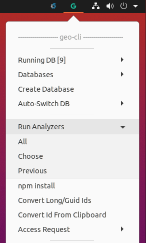
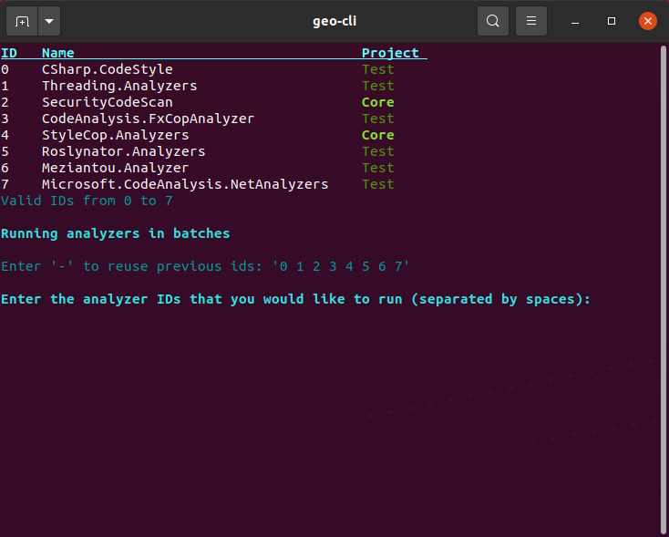

### npm install

This item will run `npm install` in both the `CheckmateServer/src/wwwroot` and `CheckmateServer/src/wwwroot/drive` directories. This is required for MyGeotab.Core to build after switching from one MyGeotab release branch to another (e.g. 9.0 to 8.0).

### Convert MyGeotab Long/Guid Ids

The following two items provide access to MyGeotab long/guid id conversion:

1. `Convert Long/Guid Ids`: Opens a terminal where you may enter a long/guid encoded/decoded id to convert. The result is copied to your clipboard
2. `Convert Id from Clipboard`: Opens a terminal, converts an id from your clipboard, copies the result to your clipboard, and then closes the terminal

> Tip: Middle clicking on the G tray icon will run `Convert Id from Clipboard`. Allowing you to quickly convert ids from your clipboard with just one click.

### Access Requests

This submenu provides access to utilities for working with access requests. It contains the following items:

1. `Create`: Opens up the Access Request page on MyAdmin where you can create a new access request
2. `IAP Tunnel`: A submenu menu for working with IAP tunnels. It has the following items:
   1. `Start New`: Opens a terminal were you can paste in the gcloud command that you copied from your MyAdmin access request. An SSH session is automatically started after the IAP tunnel is opened
   2. `Start Previous`: Opens a submenu where you can select from the previous 5 gcloud commands to reopen an IAP tunnel. An SSH session is automatically started after the IAP tunnel is opened

3. `SSH Over Open IAP`: Opens up a terminal and starts an SSH session using the port from the IAP tunnel that was most recently opened

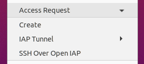 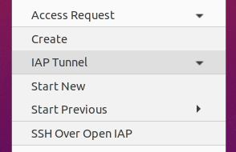 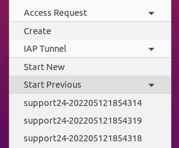

> If your SSH session is closed (e.g. via timeout), you may press Enter in the terminal to restart it.

## Help

The `Help` submenu contains the following items:

1. `Show Notifications`: Enables or disables notification from being shown
2. `View Readme`: Opens up this Readme in Chrome
3. `Disable`: Disables the ui. It can be re-enabled by opening up a terminal and running `geo indicator enable`

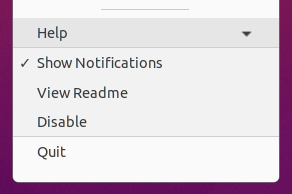

## Updates


`geo-ui` periodically checks for updates. When a new version is available, the G icon will have a red dot in the lower right corner of it (as shown above). To install the new update, click on the `Update Now` button.

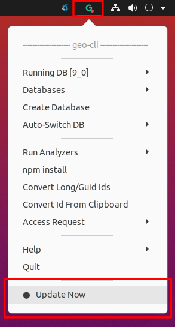

# Help

Get help for a specific command by entering `geo [command] help`.

Example:

```bash
geo db help
```

Gives you the following:

```html
    db
      Database commands.
        Commands:
            create [option] <name>
                Creates a versioned db container and volume.
                  Options:
                    -y
                      Accept all prompts.
                    -e 
                      Create blank Postgres 12 container.
            start [option] [name]
                Starts (creating if necessary) a versioned db container and volume. If no name is provided, the
                most recent db container name is started.
                  Options:
                    -y
                      Accept all prompts.
            cp <source_db> <destination_db>
                Makes a copy of an existing database container.
            rm, remove [option] <version> [additional version to remove]
                Removes the container and volume associated with the provided version (e.g. 2004).
                  Options:
                    -a, --all
                      Remove all db containers and volumes.
            stop [version]
                Stop geo-cli db container.
            ls [option]
                List geo-cli db containers.
                  Options:
                    -a, --all
                      Display all geo images, containers, and volumes.
            ps
                List running geo-cli db containers.
            init
                Initialize a running db container with geotabdemo or an empty db with a custom name.
                  Options:
                    -y
                      Accept all prompts.
            psql [options]
                Open an interactive psql session to geotabdemo (or a different db, if a db name was provided with
                the -d option) in the running geo-cli db container. You can also use the -q option to execute a
                query on the database instead of starting an interactive session. The default username and password
                used to connect is geotabuser and vircom43, respectively.
                  Options:
                    -d
                      The name of the postgres database you want to connect to. The default value used is "geotabdemo"
                    -p
                      The admin sql password. The default value used is "vircom43"
                    -q
                      A query to run with psql in the running container. This option will cause the result of the
                      query to be returned instead of starting an interactive psql terminal.
                    -u
                      The admin sql user. The default value used is "geotabuser"
            bash
                Open a bash session with the running geo-cli db container.
            script <add|edit|ls|rm> <script_name>
                Add, edit, list, or remove scripts that can be run with geo db psql -q script_name.
                  Options:
                    add
                      Adds a new script and opens it in a text editor.
                    edit
                      Opens an existing script in a text editor.
                    ls
                      Lists existing scripts.
                    rm
                      Removes a script.
        Example:
            geo db start 2004
            geo db start -y 2004
            geo db create 2004
            geo db rm 2004
            geo db rm --all
            geo db rm 7.0 8.0 9.0
            geo db cp 9.0 9.1
            geo db rm --all
            geo db ls
            geo db psql
            geo db psql -u mySqlUser -p mySqlPassword -d dbName
            geo db psql -q "SELECT * FROM deviceshare LIMIT 10"
```

While running the following results in all help being printed:

```bash
geo help
```

Click below to expand help output.

<details>

```yaml
Available commands:
    image
      Commands for working with db images.
        Commands:
            create
                Creates the base Postgres image configured to be used with geotabdemo.
            remove
                Removes the base Postgres image.
            ls
                List existing geo-cli Postgres images.
        Example:
            geo image create
    db
      Database commands.
        Commands:
            create [option] <name>
                Creates a versioned db container and volume.
                  Options:
                    -y
                      Accept all prompts.
                    -e 
                      Create blank Postgres 12 container.
            start [option] [name]
                Starts (creating if necessary) a versioned db container and volume. If no name is provided, the
                most recent db container name is started.
                  Options:
                    -y
                      Accept all prompts.
            cp <source_db> <destination_db>
                Makes a copy of an existing database container.
            rm, remove [option] <version> [additional version to remove]
                Removes the container and volume associated with the provided version (e.g. 2004).
                  Options:
                    -a, --all
                      Remove all db containers and volumes.
            stop [version]
                Stop geo-cli db container.
            ls [option]
                List geo-cli db containers.
                  Options:
                    -a, --all
                      Display all geo images, containers, and volumes.
            ps
                List running geo-cli db containers.
            init
                Initialize a running db container with geotabdemo or an empty db with a custom name.
                  Options:
                    -y
                      Accept all prompts.
            psql [options]
                Open an interactive psql session to geotabdemo (or a different db, if a db name was provided with
                the -d option) in the running geo-cli db container. You can also use the -q option to execute a
                query on the database instead of starting an interactive session. The default username and password
                used to connect is geotabuser and vircom43, respectively.
                  Options:
                    -d
                      The name of the postgres database you want to connect to. The default value used is "geotabdemo"
                    -p
                      The admin sql password. The default value used is "vircom43"
                    -q
                      A query to run with psql in the running container. This option will cause the result of the
                      query to be returned instead of starting an interactive psql terminal.
                    -u
                      The admin sql user. The default value used is "geotabuser"
            bash
                Open a bash session with the running geo-cli db container.
            script <add|edit|ls|rm> <script_name>
                Add, edit, list, or remove scripts that can be run with geo db psql -q script_name.
                  Options:
                    add
                      Adds a new script and opens it in a text editor.
                    edit
                      Opens an existing script in a text editor.
                    ls
                      Lists existing scripts.
                    rm
                      Removes a script.
        Example:
            geo db start 2004
            geo db start -y 2004
            geo db create 2004
            geo db rm 2004
            geo db rm --all
            geo db rm 7.0 8.0 9.0
            geo db cp 9.0 9.1
            geo db rm --all
            geo db ls
            geo db psql
            geo db psql -u mySqlUser -p mySqlPassword -d dbName
            geo db psql -q "SELECT * FROM deviceshare LIMIT 10"
    ar
      Helpers for working with access requests.
        Commands:
            create
                Opens up the My Access Request page on the MyAdmin website in Chrome.
            tunnel [gcloud start-iap-tunnel cmd]
                Starts the IAP tunnel (using the gcloud start-iap-tunnel command copied from MyAdmin after opening
                an access request) and then connects to the server over SSH. The port is saved and used when you
                SSH to the server using geo ar ssh. This command will be saved and re-used next time
                you call the command without any arguments (i.e. geo ar tunnel)
                  Options:
                    -s
                      Only start the IAP tunnel without SSHing into it.
                    -l
                      List and choose from previous IAP tunnel commands.
            ssh
                SSH into a server through the IAP tunnel started with geo ar ssh.
                  Options:
                    -p <port>
                      The port to use when connecting to the server. This value is optional since the port that
                      the IAP tunnel was opened on using geo ar ssh is used as the default value
                    -u <user>
                      The user to use when connecting to the server. This value is optional since the username
                      stored in $USER is used as the default value. The value supplied here will be stored and
                      reused next time you call the command
        Example:
            geo ar tunnel -s gcloud compute start-iap-tunnel gceseropst4-20220109062647 22 --project=geotab-serverops
            --zone=projects/709472407379/zones/northamerica-northeast1-b
            geo ar ssh
            geo ar ssh -p 12345
            geo ar ssh -u dawsonmyers
            geo ar ssh -u dawsonmyers -p 12345
    stop
      Stops all geo-cli containers.
        Example:
            geo stop
    init
      Initialize repo directory.
        Commands:
            repo
                Init Development repo directory using the current directory.
            npm
                Runs 'npm install' in both the wwwroot and drive CheckmateServer directories. This is quick way to
                fix the npm dependencies after Switching to a different MYG release branch.
            pat
                Sets up the GitLab Personal Access Token environment variables.
                  Options:
                    -r
                      Removes the PAT environment variables.
                    -l, --list
                      List/display the current PAT environment variable file.
        Example:
            geo init repo
            geo init npm
    env <cmd> [arg1] [arg2]
      Get, set, or list geo environment variable.
        Commands:
            get <env_var>
                Gets the value for the env var.
            set <env_var> <value>
                Sets the value for the env var.
            rm <env_var>
                Remove geo environment variable.
            ls
                Lists all env vars.
        Example:
            geo env get DEV_REPO_DIR
            geo env set DEV_REPO_DIR /home/username/repos/Development
            geo env ls
    set <env_var> <value>
      Set geo environment variable.
        Options:
            s
                Shows the old and new value of the environment variable.
        Example:
            geo set DEV_REPO_DIR /home/username/repos/Development
    get <env_var>
      Get geo environment variable.
        Example:
            geo get DEV_REPO_DIR
    rm <env_var>
      Remove geo environment variable.
        Example:
            geo rm DEV_REPO_DIR
    update
      Update geo to latest version.
        Options:
            -f, --force
                      Force update, even if already at latest version.
        Example:
            geo update
            geo update --force
    uninstall
      Remove geo-cli installation. This prevents geo-cli from being loaded into new bash terminals, but does not
      remove the geo-cli repo directory. Navigate to the geo-cli repo directory and run 'bash install.sh' to reinstall.
        Example:
            geo uninstall
    analyze [option or analyzerIds]
      Allows you to select and run various pre-build analyzers. You can optionally include the list of analyzers
      if already known.
        Options:
            -a
                Run all analyzers
            -
                Run previous analyzers
            -g
                Run run GW-Linux-Debug pipeline analyzer.
            -i
                Run analyzers individually (building each time)
        Example:
            geo analyze
            geo analyze -a
            geo analyze 0 3 6
    id
      Both encodes and decodes long and guid ids to simplify working with the MyGeotab API. The result is copied
      to your clipboard. Guid encoded ids must be prefixed with 'a' and long encoded ids must be prefixed with 'b'
        Options:
            -o
                Do not format output.
        Example:
            geo id 1234 => b4d2
            geo id b4d2 => 1234
            geo id 00e74ee1-97e7-4f28-9f5e-2ad222451f6d => aAOdO4ZfnTyifXirSIkUfbQ
            geo id aAOdO4ZfnTyifXirSIkUfbQ => 00e74ee1-97e7-4f28-9f5e-2ad222451f6d
    version, -v, --version
      Gets geo-cli version.
        Example:
            geo version
    cd <dir>
      Change to directory
        Commands:
            dev, myg
                Change to the Development repo directory.
            geo, cli
                Change to the geo-cli install directory.
        Example:
            geo cd dev
            geo cd cli
    indicator <command>
      Enables or disables the app indicator.
        Commands:
            enable
                Enable the app indicator.
            disable
                Disable the app indicator.
            start
                Start the app indicator.
            stop
                Stop the app indicator.
            restart
                Restart the app indicator.
            status
                Gets the systemctl service status for the app indicator.
            cat
                Print out the geo-indicator.service file.
            show
                Print out all configuration for the service.
            edit
                Edit the service file.
            no-service
                Runs the indicator directly (using python3).
            log
                # Show service logs.
                  Options:
                    -b[-#]
                      Shows logs since the last boot. Can also use -b-n (n is a number) to get logs from n boots ago.
        Example:
            geo indicator enable
            geo indicator disable
    test <filter>
      Runs tests on the local build of MyGeotab.
        Options:
            -d, --docker
                Run tests in a docker environment matching the one used in ci/cd pipelines. Requires docker to be
                logged into gitlab.
            -n <number of iterations>
                Runs the test(s) n times.
            -r, --random-n <number of iterations>
                Runs the test(s) n times using random seeds.
            --random-seed <seed>
                Runs the test(s) a supplied random seed.
        Example:
            geo test UserTest.AddDriverScopeTest
            geo test -r 3 UserTest.AddDriverScopeTest
            geo test
            "FullyQualifiedName=Geotab.Checkmate.ObjectModel.Tests.JSONSerializer.DisplayDiagnosticSerializerTest.DateRangeTest|FullyQualifiedName=Geotab.Checkmate.ObjectModel.Tests.JSONSerializer.DisplayDiagnosticSerializerTest.NotificationUserModifiedValueInfoTest"
    help, -h, --help
      Prints out help for all commands.
    dev
      Commands used for internal geo-cli development.
        Commands:
            update-available
                Returns "true" if an update is available
            co <branch>
                Checks out a geo-cli branch
            release
                Returns the name of the MyGeotab release version of the currently checked out branch
            databases
                Returns a list of all of the geo-cli database container names
    quarantine [options] <FullyQualifiedTestName>
      Adds quarantine annotations to a broken test and, optionally, commits the test file.
        Options:
            -b
                Only print out the git blame for the test.
            -c
                Commit the file after adding the annotations to it.
            -m <msg>
                Add a custom commit message. If absent, the default commit message will be "Quarantined test
                $testclass.$testname".
        Example:
            geo quarantine -c CheckmateServer.Tests.Web.DriveApp.Login.ForgotPasswordTest.Test
            geo quarantine -c -m 'Quarentine test' CheckmateServer.Tests.Web.DriveApp.Login.ForgotPasswordTest.Test
    mydecoder <MyDecoderExportedDeviceData.json>
      Converts device data from MyDecoder (exported as JSON) into a MyGeotab text log file. The
      output file will be in the same directory, with the same name, but with a .txt file
      extension (i.e. filename.json => filename.txt).
        Example:
            geo mydecoder MyDecoder_554215428_04_07_2022.json
```

</details>

# Troubleshooting

## Update issues

If you encounter issues while running `geo update`, try navigating to the geo-cli repo directory in a terminal and running `git pull && bash install.sh`.

## Problems Creating Databases

> *Note: you must always build MyGeotab.Core for the branch/release prior to creating a db.*

For issues while running `geo db start <version>`, try the following (to make things):

1. **Checkmate Error:Cause: EXEB84000E: Unable to upgrade 'trunk_template_2...**

   * Lets say that you're trying to create a db on a 2102 branch using `geo db start 2102` (2102 can be any alphanumeric name) and encounter this error `Checkmate Error:Cause: EXEB84000E: Unable to upgrade 'trunk_template_2102...` try checking out master and then running `geo image create`, followed by `geo db rm 2102`, and then finally `geo db start 2102` again to recreate the db. This problem arose because we upgraded to using Postgres 12, but you may have created the base db image before the changes were made in the Postgres dockerfile; so we need to rebuild your db image for the changes to take effect.

2. **DbUnavailable**

   * If you're trying to create a db using `geo db start <version>` and encounter a DbUnavilable exception, try running `geo db init`.

3. **Unable to find image 'geo_cli_db_postgres:latest' locally**

   * This error can happen when creating a db with `geo db start NAME`. This message indicates that `geo` cannot find the base Postgres image that it uses to create db containers. Fix this by running `geo image create`, followed by the same `geo db start <DB_NAME>` command again. You may want to run `geo db rm NAME` first to remove anything that was created during the earlier failed attempt.

4. **The MYG version of newly created databases doesn't match the version of the MYG repo branch used to initialize it**

   * Possible causes and solutions:
      > Make sure to remove any databases that were created with the incorrect version using `geo db rm some_db some_other_db...`

      * You are using `git worktree` (or have multiple copies of the MYG repo)and haven't re-initialize `geo` to use that location as the MyGeotab repo. Fix:
         * `cd` into whichever MYG repo/worktree you are currently using: `cd ~/path/to/current/worktree`
         * Tell `geo` to use this location as the MYG repo directory: `geo init repo`
         * Re-create the `geo` database: `geo db start <DB_NAME>`

      * There is some kind of caching/state issue
         * Run `geo myg clean`
         * Restore NuGet
         * Build MyGeotab.Core
         * Re-create the `geo` database: `geo db start <DB_NAME>`

      * If the issue persists, restart you computer and then repeat the steps from the previous point
