# `geo-cli`
A tool that makes MyGeotab development easier. Specifically, this tool aims to simplify cross-release development by managing various versions of `geotabdemo` Postgres database containers. This allows you to easily switch between release branches without having to worry about database compatibility. In the future, it also aims to simplify other pain points of development by automating them; providing an easy-to-use interface that hides the complexity under the hood.

> `geo-cli` is currently under active development and is updated often. Please contact me on Chat or through email (dawsonmyers@geotab.com) if you have a feature idea or would like to report a bug.

> `geo-cli` is only supported on Ubuntu. However, it can be made to work in WSL on Windows if you set up docker for it.

## Table of Contents
- [`geo-cli`](#geo-cli)
  - [Table of Contents](#table-of-contents)
  - [Example](#example)
  - [Getting Started with `geo-cli`](#getting-started-with-geo-cli)
    - [Install](#install)
    - [Create a Database](#create-a-database)
    - [List Databases](#list-databases)
    - [Removing Databases](#removing-databases)
    - [Creating Empty Databases](#creating-empty-databases)
    - [Running Analyzers](#running-analyzers)
  - [Help](#help)

<!-- Make images > 892 px wide -->

## Example
Lets say that you're developing a new feature on a `2004` branch of MyGeotab, but have to switch to a `2002` branch for a high priority bug fix that requires the use of `geotabdemo` (or any compatible database, for that matter). Switching to a compatible database is as simple as checking out the branch, **building the project** (only required when creating a new db container), and then running the following in a terminal:
```
geo db start 2002
```

> `2002` in the above command is just a name that you pick for the container and volume that `geo` creates for you; it can be any alphanumeric name you like. If a db container with that name already exists, it will just start that one instead of creating a new one.


The output of this command is shown below:

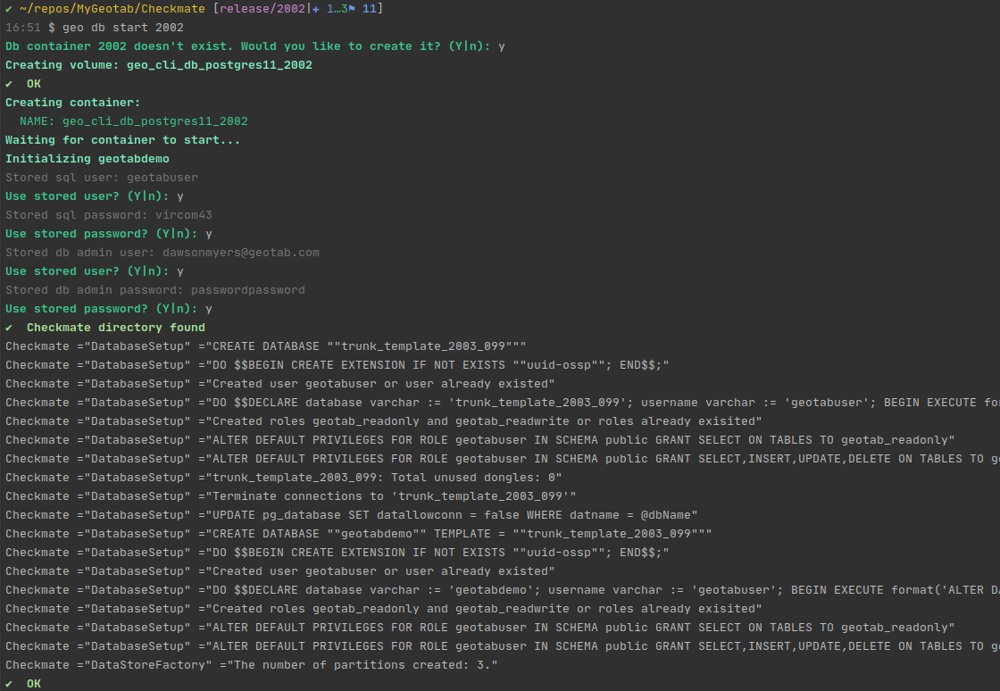

> Under the hood, `geo` is creating a Postgres container and a data volume for it. The tool then starts the container, mounted with the data volume, and then initializes `geotabdemo` on it using `dotnet CheckmateServer.dll CreateDatabase postgres ...`. This is why you have to build the project for a certain release branch before creating a new db container.

Now you may run `geotabdemo` or any tests that require a 2002 database version.

When you're done with the bug fix and want to resume working on your 2004 feature, switch back to your 2004 branch and run the following in a terminal: 
```
geo db start 2004
```
The output of this command is shown below:

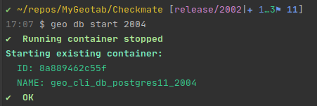

## Getting Started with `geo-cli`
### Install
Navigate to your directory of choice in a terminal and clone this repo
```
git clone git@git.geotab.com:dawsonmyers/geo-cli.git
```
Next, navigate into the repo directory
```
cd geo-cli
```
And finally, execute the install script
```
bash install.sh
```
> Docker is required for `geo` to work. You will be prompted to install it during the install process if it is missing. You must completely log out and then back in again after a Docker install for the new permissions to take effect.

You will be asked to enter the location of Development repo during the install. The tool needs to know where this is so that it knows the location of:
- The CheckmateServer dll used for initializing `geotabdemo`
- The Dockerfile used to create the base Postgres image used to build the db containers

The tool will also build the base Postgres image during the install process, so it may take several minutes to complete (even longer if you also have to install Docker).

A simple install (where I already have Docker installed and have created the base db image) is shown below:

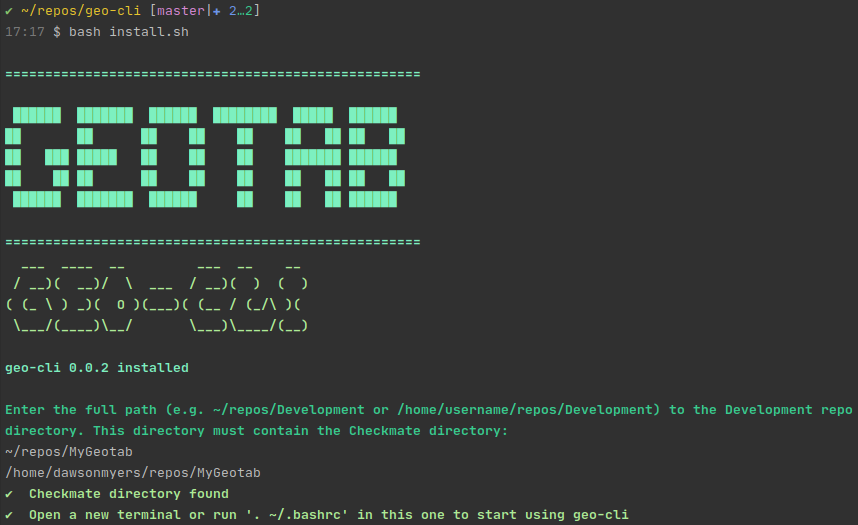

Now you can open a new terminal or run `. ~/.bashrc` to re-source .bashrc in your current one to begin using `geo`.

<!-- ### Start Using `geo-cli` -->

Now that `geo-cli` is installed, you can begin using it for creating and running various database versions for your development needs.

### Create a Database
The first thing that you want to do after installing the tool is to create a database. The MyGeotab Postgres database will be created using `CheckmateServer.dll` from the current branch that you have checked out, so you must build MyGeotab before the correct `dll` will be available to `geo-cli`.

Next, we will create, initialize, and start your first database. You will have to give it an alphanumeric name to identify it (the MyGeotab release version is usually the best name to use, e.g., `2004`). So, assuming that you're working on a `2004` branch of MyGeotab, a database could be created by entering the following in a terminal:
```
geo db start 2004
```
> You will be prompted to stop Postgres if you have it running locally or in a container. This is so that port 5432 can be made available for a `geo-cli` database.

The output is shown below:
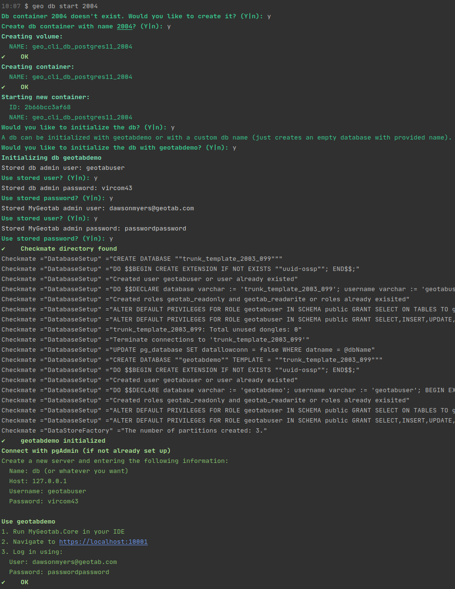

### List Databases
You can list your `geo-cli` databases using:
```
geo db ls
```
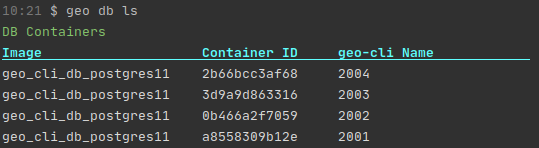

### Removing Databases
The following command will remove the `2001` database from `geo-cli`:
```
geo db rm 2001
```
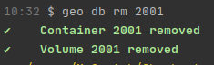

> You can delete all databases using `geo db rm --all`. You will be prompted before continuing.

You can confirm that the `2001` database has been removed by listing your `geo-cli` databases:

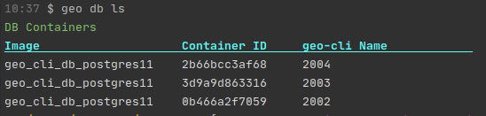

### Creating Empty Databases
`geo-cli` can also be used to create empty databases for any use case you may encounter:

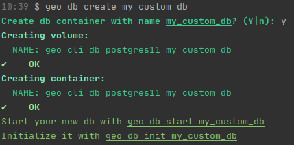

>The `geo db create` does not start the container after creating it.

### Running Analyzers
This is a new feature that is still being developed. It can be accessed using:
```
geo analyze
```
This will output the selection menu and prompt you for which analyzers you want to run:

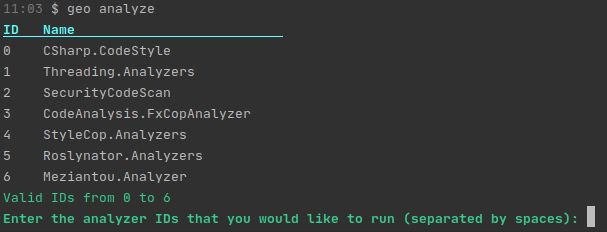

So if you wanted to run `CSharp.CodeStyle` and `StyleCop.Analyzers` you would type `0 4` and press enter:

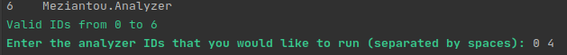

The output is then displayed as the analyzers are run:

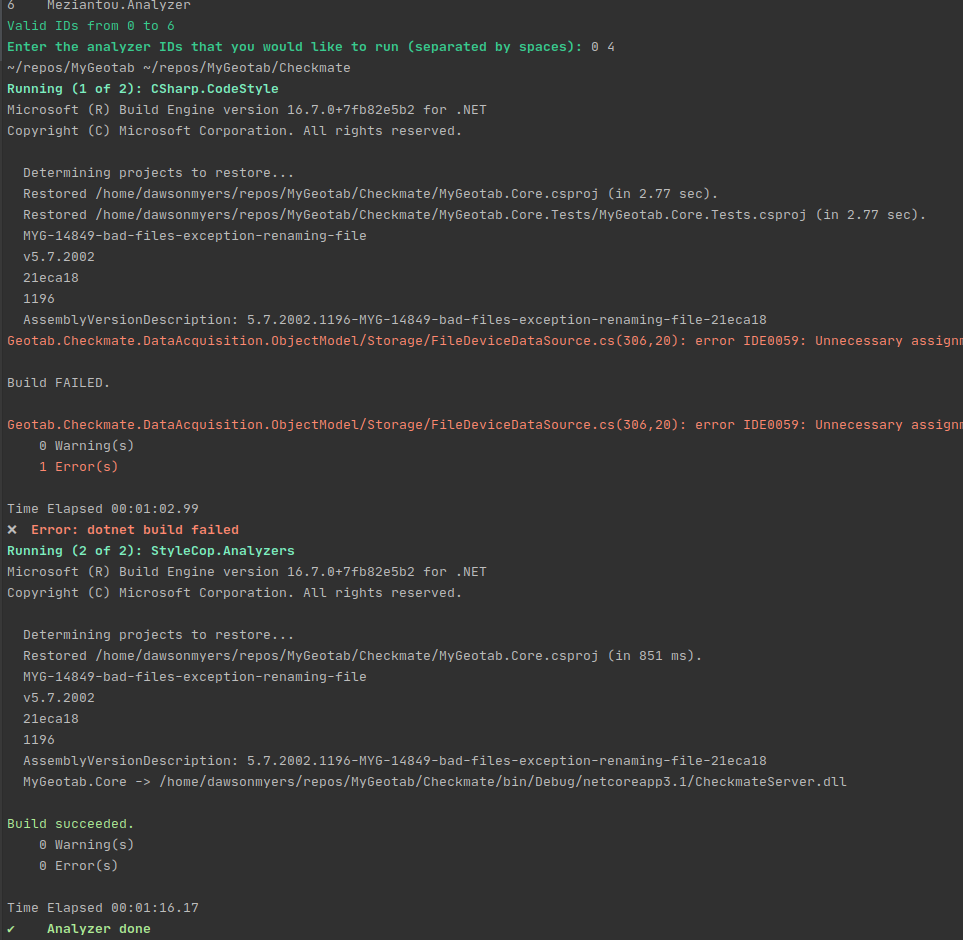


## Help
Get help for a specific command by entering `geo [command] help`.

Example:
```
geo db help
```
Gives you the following:
```
    db
      Database commands.
        Options:
            start [option] [name]
                Starts (creating if necessary) a versioned db container and
                volume. If no name is provided, the most recent db container
                name is started.
            rm, remove <version>
                Removes the container and volume associated with the provided
                version (e.g. 2004).
                  Options:
                    -a, --all
                      Remove all db containers and volumes.
            stop [version]
                Stop geo-cli db container.
            ls [option]
                List geo-cli db containers.
                  Options:
                    -a, --all
                      Display all geo images, containers, and volumes.
            ps
                List running geo-cli db containers.
            init
                Initialize a running db container with geotabdemo or an empty
                db with a custom name.
        Example:
            geo db start 2004
            geo db create 2004
            geo db rm 2004
            geo db rm --all
            geo db ls
```

While running the following results in all help being printed:
```
geo help
```
```
Available commands:
    image
      Commands for working with db images.
        Options:
            create
                Creates the base Postgres image configured to be used with geotabdemo.
            remove
                Removes the base Postgres image.
            ls
                List existing geo-cli Postgres images.
        Example:
            geo image create
    db
      Database commands.
        Options:
            create [option] <name>
                Creates a versioned db container and volume.
                  Options:
                    -y
                      Accept all prompts.
            start [option] [name]
                Starts (creating if necessary) a versioned db container and volume. If no name
                is provided, the most recent db container name is started.
                  Options:
                    -y
                      Accept all prompts.
            rm, remove <version>
                Removes the container and volume associated with the provided version (e.g. 2004).
                  Options:
                    -a, --all
                      Remove all db containers and volumes.
            stop [version]
                Stop geo-cli db container.
            ls [option]
                List geo-cli db containers.
                  Options:
                    -a, --all
                      Display all geo images, containers, and volumes.
            ps
                List running geo-cli db containers.
            init
                Initialize a running db container with geotabdemo or an empty db with a custom
                name.
                  Options:
                    -y
                      Accept all prompts.
            psql [options] [db name]
                Open a psql session to geotabdemo (default db name) in the running geo-cli db
                container. The username and password used to connect is geotabuser and vircom43,
                respectively.
                  Options:
                    -u
                      The admin sql user. The default value used is "geotabuser"
                    -p
                      The admin sql password. The default value used is "vircom43"
            bash
                Open a bash session with the running geo-cli db container.
        Example:
            geo db start 2004
            geo db start -y 2004
            geo db create 2004
            geo db rm 2004
            geo db rm --all
            geo db ls
            geo db psql
            geo db psql -u mySqlUser -p mySqlPassword dbName
    stop
      Stops all geo-cli containers.
        Example:
            geo stop
    init
      Initialize repo directory.
        Options:
            repo
                Init Development repo directory using the current directory.
        Example:
            geo init repo
    env <cmd> [arg1] [arg2]
      Get, set, or list geo environment variable.
        Options:
            get <env_var>
                Gets the value for the env var.
            set <env_var> <value>
                Sets the value for the env var.
            ls
                Lists all env vars.
        Example:
            geo env get DEV_REPO_DIR
            geo env set DEV_REPO_DIR /home/username/repos/Development
            geo env ls
    set <env_var> <value>
      Set geo environment variable.
        Example:
            geo set DEV_REPO_DIR /home/username/repos/Development
    get <env_var>
      Get geo environment variable.
        Example:
            geo get DEV_REPO_DIR
    update
      Update geo to latest version.
        Options:
            -f, --force
                      Force update, even if already at latest version.
        Example:
            geo update
            geo update --force
    uninstall
      Remove geo-cli installation. This prevents geo-cli from being loaded into new bash
      terminals, but does not remove the geo-cli repo directory. Navigate to the geo-cli repo
      directory and run 'bash install.sh' to reinstall.
        Example:
            geo uninstall
    analyze
      Allows you to select and run various pre-build analyzers.
        Example:
            geo analyze
    version, -v, --version
      Gets geo-cli version.
        Example:
            geo version
    cd <dir>
      Change to directory
        Options:
            dev, myg
                Change to the Development repo directory.
            geo, cli
                Change to the geo-cli install directory.
        Example:
            geo cd dev
            geo cd cli
    help, -h, --help
      Prints out help for all commands.

```
